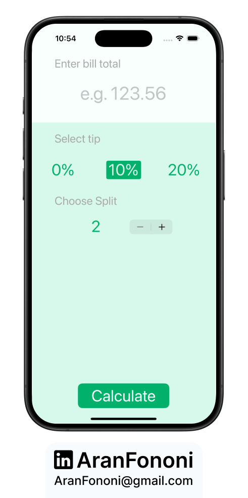
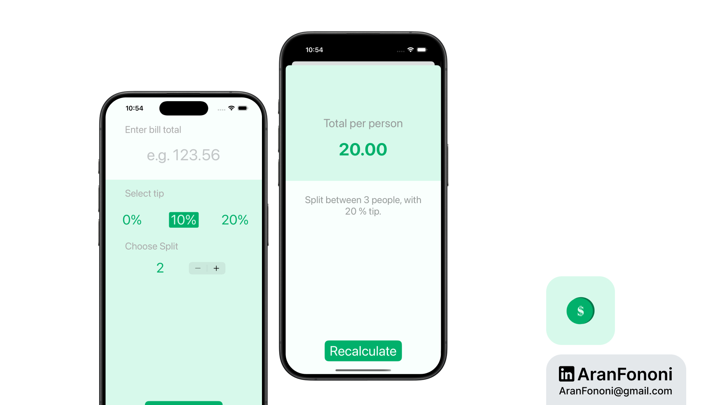

# Tip Calculator

### Project for Section 12: **Tip Calculator**  
This project was completed as part of Section 12 of the **Complete iOS Development Bootcamp** by Angela Yu.

## Project Overview
The **Tip Calculator** app allows users to enter their bill amount and select a tip percentage to calculate the total cost per person when splitting the bill among multiple users. The app features a clean interface and provides real-time updates based on user input.

## What I Learned
In this project, I focused on:
- **MVC Architecture**: Implemented the Model-View-Controller design pattern for better code organization and separation of concerns.
- **Dynamic User Interface**: Developed an interactive UI that updates in real-time based on user interactions.
- **Data Handling**: Managed data passing between view controllers for seamless navigation and result display.

## Key Skills
- Effective use of UIKit for UI design
- Strong understanding of the MVC pattern
- Ability to handle user inputs and display calculated results dynamically

## Additional Features
- Ability to customize the tip percentage with buttons
- A stepper control for selecting the number of people to split the bill

---

### Project Preview

---

### Footer

---

## Contact
For more information, feel free to reach out:  
- **Email**: [aranfononi@gmail.com](mailto:aranfononi@gmail.com)  
